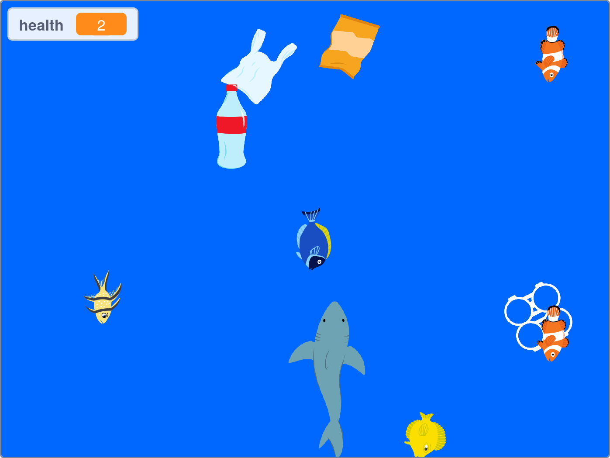

## Introduction

Use Scratch to create a game and save the shark!

### What you will make

--- no-print ---

Click to the left and right of the shark to move it. Try to eat the fish and avoid the plastic polution.

<iframe src="https://scratch.mit.edu/projects/416171540/embed" allowtransparency="true" width="485" height="402" frameborder="0" scrolling="no" allowfullscreen></iframe>

--- /no-print ---

--- print-only ---

--- /print-only ---

--- collapse ---

---
title: What you will need
---
#### Hardware

+ A Computer or tablet capable of running Scratch

#### Software

+ Scratch 3 (either [online](https://scratch.mit.edu/){:target="_blank"} or [offline](https://scratch.mit.edu/download){:target="_blank"})

--- /collapse ---

--- collapse ---

---
title: What you will learn
---

+ How to use random numbers to change costumes
+ How to generate annd delete clones
+ How to use random numbers to alter the behavior of clones

--- /collapse ---

--- collapse ---

---
title: Additional information for educators
---

You can find the completed project [here](http://rpf.io/p/en/save-the-shark-get){:target="_blank"}.

If you need to print this project, please use the [printer-friendly version](https://projects.raspberrypi.org/en/projects/save-the-shark/print){:target="_blank"}.

--- /collapse ---
