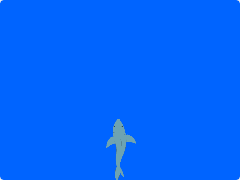
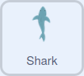

## Move the shark

In this step you will use code to control the motion of a shark on the screen using the mouse.

--- task ---

If working **online**, open the [starter project](http://rpf.io/save-the-shark-on){:target="_blank"} in Scratch.
 
If working **offline**, open the project [starter file](http://rpf.io/p/en/save-the-shark-get){:target="_blank"} in the Scratch offline editor. If you need to download and install Scratch, you can find it [here](https://scratch.mit.edu/download){:target="_blank"}.




--- /task ---

In the starter project, you should see a shark sprite, against an underwater background.

--- task ---

When the green flag is clicked, the shark should start at the bottom of the screen.



```blocks3
when flag clicked
go to x: (0) y: (-120)
```

--- /task ---

To make this project mobile friendly, you're going to use the location of the cursor when the left mouse button is pressed, or when a finger touches the screen to control the movement of the shark.

--- task ---

Add a `forever`{:class="block3control"} loop to your script, so that your program can constantly detect when the left mouse button is clicked, then use an `if...then`{:class="block3control"} block to detect if `mouse down?`{:class="block3sensing"}.


```blocks3
when flag clicked
go to x: (0) y: (-120)
+forever
if <mouse down?> then
```

--- /task ---

When the mouse is clicked, if the `mouse x`{:class="block3sensing"} position of the cursor is `less than`{:class="block3operators"} the `x position`{:class="block3motion"} of the sprite, then the sprite should `change x by -10`{:class="block3motion"}, to move left.


```blocks3
when flag clicked
go to x: (0) y: (-120)
+forever
if <mouse down?> then
+if <(mouse x) < (x position)> then
change x by (-10)
```

 --- task ---

If the `mouse x`{:class="block3sensing"} position of the cursor is `greater than`{:class="block3operators"} the `x position`{:class="block3motion"} of the sprite, then the sprite should `change x by 10`{:class="block3motion"}, to move right.


```blocks3
when flag clicked
go to x: (0) y: (-120)
+forever
if <mouse down?> then
if <(mouse x) < (x position)> then
change x by (-10)
end
+if <(mouse x) > (x position)> then
change x by (10)
```

--- /task ---

--- save ---
