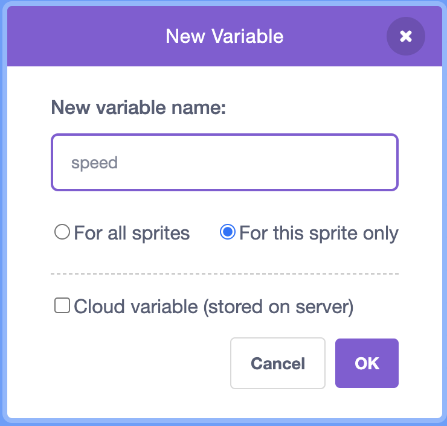

## Add plastic waste

In this step, you will add plastic waste to your game.

In the Sprite list below the Stage, click on the sprite that looks like a plastic bottle. This sprite has four costumes: a bottle, a wrapper, a bag, and a plastic can holder.

--- task ---

When the green flag is clicked, the **Plastic** sprite needs to move to the top of the Stage and then `hide`{:class="block3looks"}. Add the following code to the **Plastic** sprite:


```blocks3
when flag clicked
go to x: (0) y: (200)
hide
```

--- /task ---

--- task ---

The **Plastic** sprite now needs to randomly generate clones of itself. Add the following code:


```blocks3
when flag clicked
go to x: (0) y: (200)
hide
+forever
create clone of (myself v)
wait (pick random (1) to (5)) seconds
```

--- /task ---

--- task ---

When a clone is created, the clone needs to `show`{:class="block3looks"} itself, pick a `random`{:class="block3operators"} `costume`{:class="block3looks"}, and then move to a `random`{:class="block3operators"} `x`{:class="block3motion"} position. Add the following code as a new script:


```blocks3
when I start as a clone
show
switch costume to (pick random (1) to (4)
go to x: (pick random (-200) to (200)) y: (200)
```
--- /task ---

--- task ---

You want the plastic to move towards the bottom of the Stage at a  `random`{:class="block3operators"} speed, so create a new `variable`{:class="block3variables"} called `speed`. Set it to 'for this sprite only'.




--- /task ---

--- task ---

Set the `speed`{:class="block3variables"} to be a `random`{:class="block3operators"} number. Use a `repeat until`{:class="block3control"} block which will detect when a clone reaches `-180` on the y axis (the bottom of the stage). Move the clone down the Stage using the `speed`{:class="block3variables"} variable. And finally, add a `wait`{:class="block3control"} block with a value of `0.1` seconds so you can see the movement:


```blocks3
when I start as a clone
show
switch costume to (pick random (1) to (4)
go to x: (pick random (-200) to (200)) y: (200)
+set (speed v) to (pick random (-1) to (-10))
+repeat until <(y position) < (-180)>
change y by (speed)
wait (0.1) seconds

```

--- /task ---

Run your game, and you should see the plastic waste falling from random positions and at random speeds from the top of the Stage. The problem is that the waste accumulates at the bottom of the Stage, and stays there.

--- task ---

Add a `delete this clone`{:class="block3control"} block so that the **Plastic** sprite deletes itself when it hits the bottom of the Stage:


```blocks3
when I start as a clone
show
switch costume to (pick random (1) to (4)
go to x: (pick random (-200) to (200)) y: (200)
set (speed v) to (pick random (-1) to (-10))
repeat until <(y position) < (-180)>
change y by (speed)
wait (0.1) seconds
end
+delete this clone
```

--- /task ---

--- save ---

