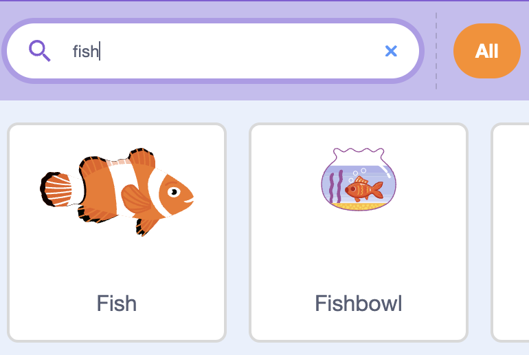
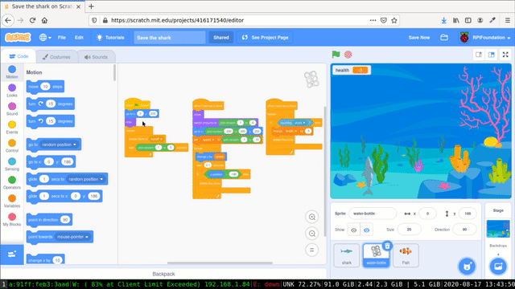
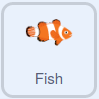

## Feed the shark

Now when you play the game, the shark needs to avoid the plastic or the game end. In this step, you'll add fish that the shark can eat to increase it's health.

--- task ---

Add the fish sprite to your project.



--- /task ---

The code for the fish sprite is almost identical to the code on the plastic sprite.

--- task ---

Drag and drop the three scripts from the plastic sprite onto the fish sprite.



--- /task ---

--- task ---
Now you can edit the code that reduces the shark's health so that it increases the health instead.



```blocks3
when I start as a clone
forever
if <touching (shark v)> then
+ change (health v) by (1)
delete this clone
```

--- /task ---

--- save ---


