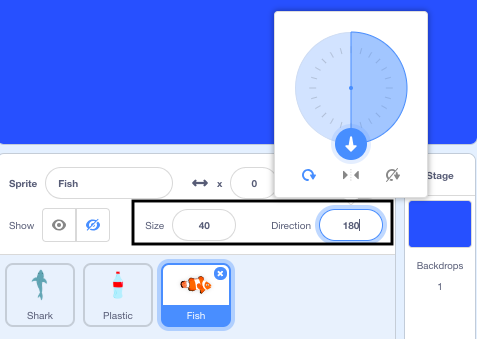

## Feed the shark

At the moment, when you play the game, the shark needs to avoid the plastic or the game ends. In this step, you will add fish that the shark can eat to increase its health.

--- task ---

Add the **Fish** sprite to your project.


--- /task ---

The code for the **Fish** sprite is almost identical to the code for the **Plastic** sprite.

--- task ---

Drag and drop the three scripts from the **Plastic** sprite onto the **Fish** sprite in the Sprite list.


--- /task ---

--- task ---
Now, you can edit the code that reduces the shark's health so that it increases its health by `1` instead:


```blocks3
when I start as a clone
forever
if <touching (Shark v)> then
+ change (health v) by (1)
delete this clone
```

--- /task ---

--- task ---

Set the **Fish** sprite size property to `40` percent and the direction property to `180` degrees. 



--- /task ---

--- task ---

Run the program again to test that the health of the shark increases if it eats fish.

--- /task ---


--- save ---


