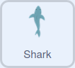

## शार्क को हिलाएँ

इस चरण में, आप खिलाड़ी को मंच पर शार्क की गति को नियंत्रित करने के लिए माउस का उपयोग करने की अनुमति देने के लिए कोड जोड़ेंगे।

--- task ---

**ऑनलाइन**: Scratch में [स्टार्टर प्रोजेक्ट](http://rpf.io/save-the-shark-on){:target="_blank"} खोलें ।

**ऑफ़लाइन:** Scratch के ऑफ़लाइन संपादक में [प्रोजेक्ट स्टार्टर फ़ाइल](http://rpf.io/p/hi-IN/save-the-shark-get){:target="_blank"} खोलें। यदि आपको ज़रूरत है तो, आप [यहां Scratch डाउनलोड और इंस्टॉल ](https://scratch.mit.edu/download){:target="_blank"} कर सकते हैं

--- /task ---

स्टार्टर प्रोजेक्ट में, आपको पानी के नीचे की पृष्ठभूमि के खिलाफ **Shark** स्प्राइट दिखनी चाहिए


--- task ---

जब हरी झंडी पर क्लिक किया जाता है, तो शार्क को Stage के नीचे से शुरू करना होता है। इस कोड को जोड़ें ताकि **Shark** स्प्राइट सही स्थिति में शुरू हो:



```blocks3
when flag clicked
go to x: (0) y: (-120)
```

--- /task ---

इस परियोजना को मोबाइल उपकरणों के लिए उपयुक्त बनाने के लिए, आप कर्सर के स्थान का उपयोग तब करेंगे जब माउस का बायां बटन दबाया जाता है, या जब कोई उंगली स्क्रीन को छूती है, शार्क की गति को नियंत्रित करने के लिए। सौभाग्य से, Scratch का `mouse down`{:class="block3sensing"} ब्लॉक दोनो माउस बटन और टचस्क्रीन पर उंगलियों के लिए काम करता है!

--- task ---

आपके प्रोग्राम को लगातार यह पता लगाने की जरूरत है कि बायां माउस बटन कब दबाया जाता है। ऐसा करने के लिए, अपने स्क्रिप्ट में `forever`{:class="block3control"} लूप जोड़ें, फिर `if ... then`{:class="block3control"} ब्लॉक का उपयोग करके पता लगाएं कि क्या `mouse down`{:class="block3sensing"}:


```blocks3
when flag clicked
go to x: (0) y: (-120)
+forever
if <mouse down?> then
```

--- /task ---

--- task ---

यदि उपयोग करने वाला **Shark** स्प्राइट की स्थिति के बजाए मंच के के बाईं ओर के पास कर्सर क्लिक करता है, तब **Shark** स्प्राइट बाईं ओर चला जाता है।

यह क्रिया संभव है क्योंकि x अक्ष के साथ कर्सर की स्थिति `mouse x`{:class="block3sensing"} ब्लॉक में संग्रहीत है।

उपयोगकर्ता जहां क्लिक करता है, उस पर प्रतिक्रिया देने के लिए प्रोग्राम प्राप्त करने के लिए, निम्नलिखित ब्लॉक जोड़ें: `if`{:class="block3control"} `mouse x`{:class="block3sensing"} **Shark** स्प्राइट की `x position`{:class="block3motion"} से `less than`{:class="block3operators"} है `then`{:class="block3control"} स्प्राइट को `change x by`{:class="block3motion"} `-10` से बाईं ओर जाना चाहिए:


```blocks3
when flag clicked
go to x: (0) y: (-120)
forever
if <mouse down?> then
+if <(mouse x) < (x position)> then
change x by (-10)
next costume
```

--- /task ---

--- task ---

जब आप शार्क के बाईं ओर क्लिक करते हैं तो शार्क बाईं ओर चलती है या नहीं, इसका परीक्षण करने के लिए प्रोग्राम चलाने के लिए हरे झंडे पर क्लिक करें।

--- /task ---

--- task ---

जब माउस क्लिक किया जाता है, `if`{:class="block3control"} `mouse x`{:class="block3sensing"} `x position`{:class="block3motion"}, `then`{:class="block3control"} से `greater than`{:class="block3operators"} है तो **Shark** स्प्राइट दाईं ओर ले जाने के लिए `change x by`{:class="block3motion"} `10` बदलना चाहिए। निम्नलिखित ब्लॉक जोड़ें:


```blocks3
when flag clicked
go to x: (0) y: (-120)
forever
if <mouse down?> then
if <(mouse x) < (x position)> then
change x by (-10)
next costume
end
+if <(mouse x) > (x position)> then
change x by (10)
next costume
```

--- /task ---

--- task ---

जब आप शार्क के बाईं ओर क्लिक करते हैं तो शार्क बाईं ओर चलती है या नहीं, इसका परीक्षण करने के लिए प्रोग्राम चलाने के लिए हरे झंडे पर क्लिक करें।

--- /task ---

--- save ---
