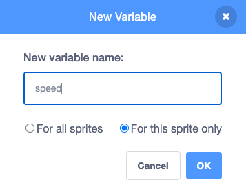

## प्लास्टिक कचरा जोड़ें

इस चरण में, आप अपने खेल में प्लास्टिक कचरा जोड़ेंगे।

Stage के नीचे Sprite सूची में प्लास्टिक की बोतल की तरह दिखने वाले स्प्राइट पर क्लिक करें। इस स्प्राइट में चार पोशाकें हैं: एक बोतल, एक रैपर, एक थैली और एक प्लास्टिक कैन होल्डर।

--- task ---

जब हरी झंडी पर क्लिक किया जाता है, तो **Plastic** स्प्राइट को Stage के शीर्ष पर ले जाने की आवश्यकता होती है और फिर `hide`{:class="block3looks"}। निम्नलिखित कोड को **Plastic** स्प्राइट में जोड़ें:


```blocks3
when flag clicked
go to x: (0) y: (200)
hide
```

--- /task ---

--- task ---

**Plastic** स्प्राइट को अब बेतरतीब ढंग से खुद के क्लोन बनाने की जरूरत है। निम्नलिखित कोड जोड़ें:


```blocks3
when flag clicked
go to x: (0) y: (200)
hide
+forever
create clone of (myself v)
wait (pick random (1) to (5)) seconds
```

--- /task ---

--- task ---

जब एक क्लोन बनाया जाता है, तो क्लोन को `शो`{:class="block3looks"} की जरूरत होती है, एक `random`{:class="block3operators"} `costume`{:class="block3looks"} चुनें, और फिर `random`{:class="block3operators"} `x`{:class="block3motion"} स्थिति पर जाएं। निम्नलिखित कोड को एक नई स्क्रिप्ट के रूप में जोड़ें:


```blocks3
when I start as a clone
show
switch costume to (pick random (1) to (4)
go to x: (pick random (-200) to (200)) y: (200)
```

--- /task ---

--- task ---

आप चाहते हैं की प्लास्टिक Stage के नीच की और `random`{:class="block3operators"} गति से  जाए, तो इसके लिए एक नया `variable`{:class="block3variables"} बनाएं जिसे `speed` कहा जाता है। इसे `For this sprite only` पर सेट करें:




--- /task ---

--- task ---

`speed`{:class="block3variables"} को `random`{:class="block3operators"} संख्या के रूप में सेट करें। `repeat until`{:class="block3control"} ब्लॉक का उपयोग करें जो यह पता लगाएगा कि कब कोई क्लोन y अक्ष (मंचके नीचे) `-180` पर पहुच जाता है। `speed`{:class="block3variables"} वेरिएबल का उपयोग करके क्लोन को Stage से नीचे ले जाएं। और अंत में, `0.1` सेकेंड्स मान के साथ `wait`{:class="block3control"} ब्लॉक जोड़ें ताकि आप चाल देख सकें:


```blocks3
when I start as a clone
show
switch costume to (pick random (1) to (4)
go to x: (pick random (-200) to (200)) y: (200)
+set (speed v) to (pick random (-1) to (-10))
+repeat until <(y position) < (-180)>
change y by (speed)
wait (0.1) seconds

```

--- /task ---

अपना गेम चलाएं, और आपको प्लास्टिक कचरे को यादृच्छिक स्थिति और यादृच्छिक गति से Stage के ऊपर से गिरते हुए दिखना चाहिए। समस्या यह है कि कचरा Stage के नीचे जमा हो जाता है, और वहीं रहता है।

--- task ---

एक `delete this clone`{:class="block3control"} जोड़ें ताकि **Plastic** स्प्राइट अपने आपको तो खुद ही हटा देता है जब वह Stage के नीचे गिरता है:


```blocks3
when I start as a clone
show
switch costume to (pick random (1) to (4)
go to x: (pick random (-200) to (200)) y: (200)
set (speed v) to (pick random (-1) to (-10))
repeat until <(y position) < (-180)>
change y by (speed)
wait (0.1) seconds
end
+delete this clone
```

--- /task ---

--- save ---

