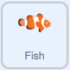

## शार्क को खिलाएं

इस समय, जब आप गेम खेलते हैं तो शार्क को प्लास्टिक से बचने की जरूरत होती है नही तो गेम खत्म हो जाता है। इस चरण में, आप उस मछली को शामिल करेंगे जिसे शार्क अपने स्वास्थ्य को बढ़ाने के लिए खा सकती है।

--- task ---

अपने प्रोजेक्ट में **Fish** स्प्राइट जोड़ें


--- /task ---

**Fish** स्प्राइट का कोड **Plastic** स्प्राइट के कोड के लगभग समान है।

--- task ---

**Plastic** स्प्राइट में से तीन स्क्रिप्ट खींचें और Sprite सूची में से **Fish** स्प्राइट में छोड़ें।


--- /task ---

--- task ---

अब, आप उस कोड को संपादित कर सकते हैं जो शार्क के स्वास्थ्य को कम करता है ताकि वह इसके बजाय स्वास्थ्य को `1` से बढ़ता है:



```blocks3
when I start as a clone
forever
if <touching (Shark v)> then
+ change (health v) by (1)
delete this clone
```

--- /task ---

--- task ---

**Fish** स्प्राइट के आकर गुण को `40` पर और दिशा गुण को `180` डिग्री पर सेट करें।


--- /task ---

--- task ---

यह जांचने के लिए प्रोग्राम को फिर से चलाएं कि मछली खाने से शार्क का स्वास्थ्य बढ़ता है या नहीं।

--- /task ---


--- save ---


