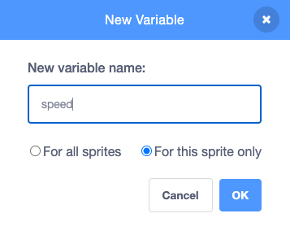

## ಪ್ಲಾಸ್ಟಿಕ್ ತ್ಯಾಜ್ಯವನ್ನು ಸೇರಿಸಿ

ಈ ಹಂತದಲ್ಲಿ, ನೀವು ನಿಮ್ಮ ಆಟಕ್ಕೆ ಪ್ಲಾಸ್ಟಿಕ್‌ ತ್ಯಾಜ್ಯವನ್ನು ಸೇರಿಸುತ್ತೀರಿ.

Stage ಕೆಳಗಿರುವ Sprite ಲಿಸ್ಟ್‌ನಲ್ಲಿ, ಪ್ಲಾಸ್ಟಿಕ್‌ ಬಾಟಲಿಯಂತೆ ಕಾಣಿಸುವ ಸ್ಪ್ರೈಟ್‌ ಮೇಲೆ ಕ್ಲಿಕ್‌ ಮಾಡಿ. ಈ ಸ್ಪ್ರೈಟ್‌ಗೆ ನಾಲ್ಕು ಉಡುಪುಗಳಿವೆ: ಒಂದು ಬಾಟಲಿ, ಒಂದು ಹೊದಿಕೆ, ಒಂದು ಚೀಲ, ಮತ್ತು ಒಂದು ಪ್ಲಾಸ್ಟಿಕ್‌ ಕ್ಯಾನ್‌ ಹೋಲ್ಡರ್.

--- task ---

ಹಸಿರು ಬಾವುಟವನ್ನು ಕ್ಲಿಕ್‌ ಮಾಡಿದಾಗ, **Plastic** ಸ್ಪ್ರೈಟ್‌ Stage ನ ಮೇಲಕ್ಕೆ ಚಲಿಸಬೇಕು ಮತ್ತು ನಂತರ `hide`{:class="block3looks"}. **Plastic** ಸ್ಪ್ರೈಟ್‌ಗೆ ಈ ಕೆಳಗಿನ ಕೋಡ್‌ನ್ನು ಸೇರಿಸಿ:


```blocks3
when flag clicked
go to x: (0) y: (200)
hide
```

--- /task ---

--- task ---

**Plastic** ಸ್ಪ್ರೈಟ್‌ ಈಗ ತನ್ನ ತದ್ರೂಪಗಳನ್ನು ಯಾದೃಚ್ಛಿಕವಾಗಿ ಉತ್ಪತ್ತಿಮಾಡಬೇಕು. ಕೆಳಗಿನ ಕೋಡ್ ಸೇರಿಸಿ:


```blocks3
when flag clicked
go to x: (0) y: (200)
hide
+forever
create clone of (myself v)
wait (pick random (1) to (5)) seconds
```

--- /task ---

--- task ---

ತದ್ರೂಪವು ರಚನೆಯಾದಾಗ, ತದ್ರೂಪವು ತನ್ನನ್ನು ತಾನು `show`{:class="block3looks"} ಮಾಡಬೇಕು, `random`{:class="block3operators"} `costume`{:class="block3looks"} ಆಯ್ದುಕೊಳ್ಳಬೇಕು, ಮತ್ತು ನಂತರ `random`{:class="block3operators"} `x`{:class="block3motion"} ಸ್ಥಾನಕ್ಕೆ ಚಲಿಸಬೇಕು. ಈ ಕೆಳಗಿನ ಕೋಡ್‌ನ್ನು ಹೊಸ ಬರಹವಾಗಿ ಸೇರಿಸಿ:


```blocks3
when I start as a clone
show
switch costume to (pick random (1) to (4)
go to x: (pick random (-200) to (200)) y: (200)
```

--- /task ---

--- task ---

ನಿಮಗೆ ಪ್ಲಾಸ್ಟಿಕ್‌  Stage ನ ಕೆಳಭಾಗದೆಡೆಗೆ  `random`{:class="block3operators"} ವೇಗದಲ್ಲಿ ಚಲಿಸಬೇಕು, ಆದುದರಿಂದ ನೀವು  `speed` ಎನ್ನುವ ಹೊಸ `variable`{:class="block3variables"} ರಚಿಸುತ್ತೀರಿ. ಅದನ್ನು `For this sprite only`ಗೆ ಹೊಂದಿಸಿ:




--- /task ---

--- task ---

`speed`{:class="block3variables"} ನ್ನು `random`{:class="block3operators"} ಸಂಖ್ಯೆಯಾಗಿ ಹೊಂದಿಸಿ. `repeat until`{:class="block3control"} ಬ್ಲಾಕ್‌ನ್ನು ಉಪಯೋಗಿಸಿ, ಅದು ತದ್ರೂಪವು y ಅಕ್ಷದ ಮೇಲೆ `-180` ತುಲುಪಿದಾಗ (ವೇದಿಕೆಯ ಕೆಳಭಾಗ) ಪತ್ತೆ ಹಚ್ಚುತ್ತದೆ. `speed`{:class="block3variables"} ವೇರಿಯೇಬಲ್‌ ಉಪಯೋಗಿಸಿ ತದ್ರೂಪವನ್ನು Stage ಕೆಳಗೆ ಚಲಿಸಿ. ಮತ್ತು ಅಂತಿಮವಾಗಿ, `wait`{:class="block3control"} ಬ್ಲಾಕ್‌ನ್ನು `0.1` ಸೆಕೆಂಡುಗಳ ಮೌಲ್ಯದೊಂದಿಗೆ ಸೇರಿಸಿ, ಅದರಿಂದ ನೀವು ಚಲನೆಯನ್ನು ನೋಡಬಹುದು:


```blocks3
when I start as a clone
show
switch costume to (pick random (1) to (4)
go to x: (pick random (-200) to (200)) y: (200)
+set (speed v) to (pick random (-1) to (-10))
+repeat until <(y position) < (-180)>
change y by (speed)
wait (0.1) seconds

```

--- /task ---

ನಿಮ್ಮ ಆಟವನ್ನು ರನ್‌ ಮಾಡಿ, ಮತ್ತು Stage ಮೇಲಿನಿಂದ ಪ್ಲಾಸ್ಟಿಕ್‌ ತ್ಯಾಜ್ಯ ಯಾದೃಚ್ಛಿಕ ಸ್ಥಾನಗಳಿಂದ ಮತ್ತು ಯಾದೃಚ್ಛಿಕ ವೇಗಗಳಿಂದ ಬೀಳುವುದನ್ನು ನೀವು ನೋಡಬೇಕು. ಸಮಸ್ಯೆ ಎಂದರೆ Stage ನ ಕೆಳಭಾಗದಲ್ಲಿ ತ್ಯಾಜ್ಯ ಸಂಗ್ರಹಗೊಂಡು ಅಲ್ಲಿಯೇ ಉಳಿಯುತ್ತದೆ.

--- task ---

Stage ನ ಕೆಳಭಾಗವನ್ನು ಬಡಿದಾಗ **Plastic** ಸ್ಪ್ರೈಟ್‌ ತನ್ನನ್ನು ತಾನೆ ಅಳಿಸಿಹಾಕಲು `delete this clone`{:class="block3control"} ಬ್ಲಾಕ್‌ ಸೇರಿಸಿ:


```blocks3
when I start as a clone
show
switch costume to (pick random (1) to (4)
go to x: (pick random (-200) to (200)) y: (200)
set (speed v) to (pick random (-1) to (-10))
repeat until <(y position) < (-180)>
change y by (speed)
wait (0.1) seconds
end
+delete this clone
```

--- /task ---

--- save ---

