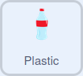

## ಶಾರ್ಕ್‌ನ ಆರೋಗ್ಯವನ್ನು ಗಮನಿಸಿ

ಈ ಹಂತದಲ್ಲಿ, ನೀವು ಆರೋಗ್ಯದ ಅಂಶಗಳನ್ನು ಸೇರಿಸಲು `variable`{:class="block3variables"} ಉಪಯೋಗಿಸುವಿರಿ. ಶಾರ್ಕ್‌ ಆಕಸ್ಮಾತ್‌ ಆಗಿ ಪ್ಲಾಸ್ಟಿಕ್‌ ತ್ಯಾಜ್ಯ ತಿಂದರೆ ಅದರ ಆರೋಗ್ಯ ಕುಸಿಯುತ್ತದೆ.

--- task ---

`health` ಎಂದು ಕರೆಯುವ ಹೊಸ `variable`{:class="block3variables"} ರಚಿಸಿ.

--- /task ---

--- task ---

Sprite ಲಿಸ್ಟ್‌ನಲ್ಲಿರುವ **Shark** ಸ್ಪ್ರೈಟ್‌ ಮೇಲೆ ಕ್ಲಿಕ್‌ ಮಾಡಿ. ಬ್ಲಾಕ್‌ಗಳನ್ನು ಸೇರಿಸಿ ಅದರಿಂದ ಆಟ ಪ್ರಾರಂಭವಾದಾಗ, ಶಾರ್ಕ್‌ನ ಆರೋಗ್ಯವನ್ನು `20` ಕ್ಕೆ ಹೊಂದಿಸಲಾಗಿರುತ್ತದೆ, ಮತ್ತು ಶಾರ್ಕ್‌ನ ಆರೋಗ್ಯ `0` ಕ್ಕಿಂತ ಕೆಳಕ್ಕೆ ಹೋದಾಗ, ಆಟ ಮುಗಿಯುತ್ತದೆ:


```blocks3
when flag clicked
go to x: (0) y: (-120)
+set (health v) to (20)
forever
if <mouse down?> then
if <(mouse x) < (x position)> then
change x by (-10)
end
if <(mouse x) > (x position)> then
change x by (10)
end
+if <(health) < (0)> then
stop (all v)
```

--- /task ---

--- task ---

**Plastic** ಸ್ಪ್ರೈಟ್‌ಗೆ ಮತ್ತೆ ಹೋಗಿ. ಶಾರ್ಕ್‌ ಯಾವುದಾದರೂ ಪ್ಲಾಸ್ಟಿಕ್‌ನ್ನು ಆಕಸ್ಮಿಕವಾಗಿ ತಿಂದರೆ ಅದರ ಆರೋಗ್ಯ `-5` ರಷ್ಟು ಕುಸಿಯಲು ಯಾವುದಾದರೂ ಕೋಡ್‌ ಸೇರಿಸಿ:



```blocks3
when I start as a clone
forever
if <touching (Shark v)> then
change (health v) by (-5)
delete this clone
```

--- /task ---

--- task ---

ಶಾರ್ಕ್ ಪ್ಲಾಸ್ಟಿಕ್ ತಿಂದರೆ ಅದರ ಆರೋಗ್ಯ ಕುಸಿಯುತ್ತದೆ ಎಂದು ಪರೀಕ್ಷಿಸಲು ಪ್ರೋಗ್ರಾಮ್‌ನ್ನು ಮತ್ತೊಮ್ಮೆ ರನ್ ಮಾಡಿ.

--- /task ---

--- save ---
