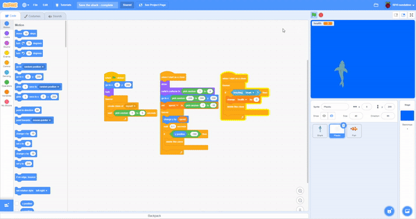

## ಶಾರ್ಕ್‌ಗೆ ಆಹಾರ ನೀಡಿ

ಈ ಸಮಯದಲ್ಲಿ, ನೀವು ಆಟವನ್ನು ಆಡುವಾಗ, ಶಾರ್ಕ್ ಪ್ಲಾಸ್ಟಿಕ್‌ನ್ನು ತಪ್ಪಿಸಬೇಕು ಇಲ್ಲವಾದರೆ ಆಟವು ಕೊನೆಗೊಳ್ಳುತ್ತದೆ. ಈ ಹಂತದಲ್ಲಿ, ಶಾರ್ಕ್‌ ತನ್ನ ಆರೋಗ್ಯ ಹೆಚ್ಚಿಸಲು ತಿನ್ನಬಹುದಾದ ಮೀನನ್ನು ನೀವು ಸೇರಿಸುತ್ತೀರಿ.

--- task ---

**Fish** ಸ್ಪ್ರೈಟ್‌ನ್ನು ನಿಮ್ಮ ಪ್ರಾಜೆಕ್ಟ್‌ಗೆ ಸೇರಿಸಿ.


--- /task ---

**Fish** ಸ್ಪ್ರೈಟ್‌ನ ಕೋಡ್‌ ಬಹುತೇಕ **Plastic** ಸ್ಪ್ರೈಟ್‌ ಕೋಡ್‌ನ್ನು ಹೋಲುತ್ತದೆ.

--- task ---

Sprite ಲಿಸ್ಟ್‌ನಲ್ಲಿರುವ **Plastic** ಸ್ಪ್ರೈಟ್‌ನ ಮೂರು ಬರಹಗಳನ್ನು ಎಳೆದು **Fish** ಸ್ಪ್ರೈಟ್‌ಗೆ ಹಾಕಿ.



--- /task ---

--- task ---

ಈಗ, ನೀವು ಶಾರ್ಕ್‌ನ ಆರೋಗ್ಯವನ್ನು ಕುಗ್ಗಿಸುವ ಕೋಡ್‌ನ್ನು ಎಡಿಟ್‌ ಮಾಡಬಹುದು ಅದರಿಂದ ಅದು ಕುಗ್ಗಿಸುವ ಬದಲು `1` ರಷ್ಟು ಹೆಚ್ಚಿಸುತ್ತದೆ:


```blocks3
when I start as a clone
forever
if <touching (Shark v)> then
+ change (health v) by (1)
delete this clone
```

--- /task ---

--- task ---

**Fish** ಸ್ಪ್ರೈಟ್‌ನ ಗಾತ್ರದ ಗುಣಲಕ್ಷಣವನ್ನು ಶೇಕಡಾ `40` ಗೆ ಹೊಂದಿಸಿ ಮತ್ತು ದಿಕ್ಕಿನ ಗುಣಲಕ್ಷಣವನ್ನು `180` ಡಿಗ್ರಿಗಳಿಗೆ ಹೊಂದಿಸಿ.


--- /task ---

--- task ---

ಮೀನನ್ನು ತಿಂದರೆ ಶಾರ್ಕ್‌ನ ಆರೋಗ್ಯ ಹೆಚ್ಚುತ್ತದೆ ಎಂದು ಪರೀಕ್ಷಿಸಲು ಪ್ರೋಗ್ರಾಮ್‌ನ್ನು ಮತ್ತೊಮ್ಮೆ ರನ್ ಮಾಡಿ.

--- /task ---


--- save ---


