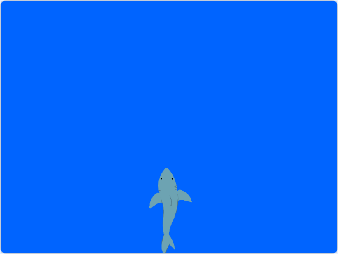

## शार्क हलवा

या टप्प्यात, तुम्ही प्लेयरला Stage वरील शार्कची हालचाल नियंत्रीत करण्यासाठी माऊसचा वापर करण्याची परवानगी द्याल.

--- task ---

**ऑनलाईन:** Scratch मधील [स्टार्टर प्रोजेक्ट](http://rpf.io/save-the-shark-on){:target="_blank"} उघडा.

**ऑफलाईन:** Scratch ऑफलाईन एडिटरमधील [प्रोजेक्ट स्टार्टर फाईल](http://rpf.io/p/en/save-the-shark-get){:target="_blank"} उघडा. तुम्हाला आवश्यकता असल्यास, तुम्ही [येथे Scratch डाऊनलोड आणि इंस्टॉल करू शकता](https://scratch.mit.edu/download){:target="_blank"}.

--- /task ---

स्टार्टर प्रोजेक्टमध्ये, तुम्ही पाण्याखालील बॅकग्राऊंडमधील **Shark** स्प्राईट बघायला हवा.



--- task ---

हिरव्या झेंड्यावर क्लिक केल्यावर, शार्कने Stage च्या खालच्या भागात सुरूवात करायला हवी. हा कोड जोडा जेणेकरून **Shark** स्प्राईट योग्य पोजिशनमध्ये सुरूवात करेल:


```blocks3
when flag clicked
go to x: (0) y: (-120)
```

--- /task ---

हा प्रोजेक्ट सर्व मोबाईल डिव्हाईससाठी सोयीस्कर बनविण्यासाठी, माऊसचे लेफ्ट बटन दाबल्यावर, किंवा बोट स्क्रीनला टच झाल्यावर, शार्कची हालचाल नियंत्रीत करण्यासाठी तुम्ही कर्सरचे लोकेशन वापराल. नशीबाने, माऊस बटनवरील बोट आणि टचस्क्रीन साठी Scratch चा `mouse down`{:class="block3sensing"} ब्लॉक कार्य करतो!

--- task ---

माऊसचे लेफ्ट बटन दाबल्यावर तुमच्या प्रोग्रामने सातत्याने शोधणे आवश्यक आहे. हे करण्यासाठी, `forever`{:class="block3control"} लूप तुमच्या स्क्रिप्टला जोडा, त्यानंतर `if ... then`{:class="block3control"} ब्लॉक वापरा `mouse down`{:class="block3sensing"} आहे का ते शोधण्यासाठी:


```blocks3
when flag clicked
go to x: (0) y: (-120)
+forever
if <mouse down?> then
```

--- /task ---

--- task ---

यूजरने Stage च्या डाव्या-हात्या बाजूच्या जवळ असलेल्या कर्सरवर क्लिक केल्यास **Shark** स्प्राईट पोजिशन घेतो, त्यानंतर **Shark** स्प्राईट डावीकडे हलतो.

ही कृती शक्य आहे कारण x अक्षाकडील कर्सरची पोजिशन `mouse x`{:class="block3sensing"} ब्लॉकमध्ये स्टोअर असते.

यूजरने क्लिक केल्यावर प्रोग्रामने प्रतिसाद देण्यासाठी, खालील ब्लॉक्स जोडा: `if`{:class="block3control"} `mouse x`{:class="block3sensing"} आहे `less than`{:class="block3operators"} `x position`{:class="block3motion"} च्या **Shark** स्प्राईट, `then`{:class="block3control"} स्प्राईटने `change x by`{:class="block3motion"} `-10` बदलावी डावीकडे हलण्यासाठी:


```blocks3
when flag clicked
go to x: (0) y: (-120)
forever
if <mouse down?> then
+if <(mouse x) < (x position)> then
change x by (-10)
next costume
```

--- /task ---

--- task ---

तुम्ही शार्कच्या डावीकडे क्लिक केल्यावर शार्क डावीकडे हलतो का ते तपासण्यासाठी प्रोग्राम रन करण्यास हिरव्या झेंड्यावर क्लिक करा.

--- /task ---

--- task ---

माऊसवर क्लिक केल्यावर, `if`{:class="block3control"} `mouse x`{:class="block3sensing"} हा `greater than`{:class="block3operators"} `x position`{:class="block3motion"}, `then`{:class="block3control"} **Shark** स्प्राईट उजवीकडे हलण्यासाठी `change x by`{:class="block3motion"} `10` हवा. खालील कोड जोडा:


```blocks3
when flag clicked
go to x: (0) y: (-120)
forever
if <mouse down?> then
if <(mouse x) < (x position)> then
change x by (-10)
next costume
end
+if <(mouse x) > (x position)> then
change x by (10)
next costume
```

--- /task ---

--- task ---

जेव्हा तुम्ही शार्कच्या उजवीकडे क्लिक करता तेव्हा शार्क उजवीकडे सरकतो का हे तपासण्यासाठी प्रोग्राम चालविण्यासाठी हिरव्या झेंड्यावर क्लिक करा.

--- /task ---

--- save ---
