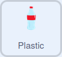

## शार्कच्या आरोग्यावर लक्ष ठेवा

या टप्प्यात, तुम्ही आरोग्य सुत्रासह `variable`{:class="block3variables"} वापराल. शार्कने अचानकपणे प्लास्टीक कचरा खाल्ल्यास त्याचे आरोग्य कमी होईल.

--- task ---

नवीन `variable`{:class="block3variables"} तयार करा ज्याला `health` म्हणतात.

--- /task ---

--- task ---

Sprite लीस्टमधील **Shark** स्प्राईटवर क्लिक करा. ब्लॉक्स जोडा जेणेकरून गेम चालू झाल्यावर, शार्कचे आरोग्य `20` ला सेट होईल, आणि शार्कचे आरोग्य `0` पेक्षा कमी झाल्यास, गेम समाप्त होईल:


```blocks3
when flag clicked
go to x: (0) y: (-120)
+set (health v) to (20)
forever
if <mouse down?> then
if <(mouse x) < (x position)> then
change x by (-10)
end
if <(mouse x) > (x position)> then
change x by (10)
end
+if <(health) < (0)> then
stop (all v)
```

--- /task ---

--- task ---

**Plastic** स्प्राईटवर परत जा. शार्कने अचानकपणे कोणतेही प्लास्टीक खाल्ल्यास शार्कचे आरोग्य `-5` ने कमी होण्यासाठी काही कोड जोडा:



```blocks3
when I start as a clone
forever
if <touching (Shark v)> then
change (health v) by (-5)
delete this clone
```

--- /task ---

--- task ---

शार्कने प्लास्टीक खाल्ल्यावर त्याचे आरोग्य कमी होते का हे तपासण्यासाठी पुन्हा प्रोग्राम रन करा.

--- /task ---

--- save ---
