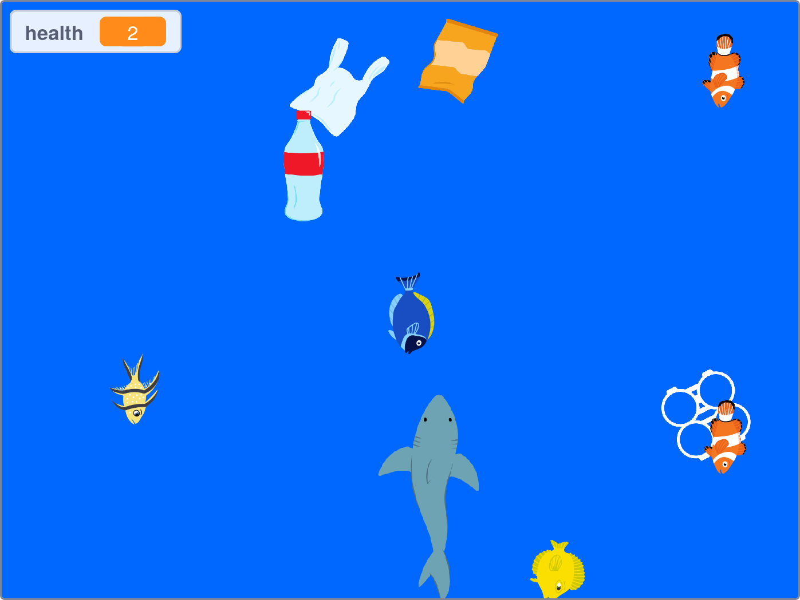

## పరిచయం

గేమ్‌ని సృష్టించడానికి మరియు సొరచేపని సేవ్ చేయడానికి Scratch ఉపయోగించండి! సొరచేపలకు ఇష్టమైన ఆహార వనరులను (చేపలు, మానవులు కాదు!), అలాగే నీటిలోని ప్లాస్టిక్ ప్రభావం సొరచేపలకు వాటి సహజమైన సముద్ర నివాస స్థలంలో హాని కలిగించడాన్ని పరిశోధించండి.

ఈ గేమ్ United Nations సస్టైనబుల్ డెవలప్‌మెంట్ గోల్స్‌లో రెండింటిని కలిగి ఉంది: [Life below Water](https://www.undp.org/sustainable-development-goals#below-water){:target="_blank"} మరియు [Responsible Consumption and Production](https://www.undp.org/sustainable-development-goals#responsible-consumption-and-production){:target="_blank"}.

### మీరు ఏమి చేయబోతున్నారు

--- no-print ---

సొరచేపను కదిలించడానికి ఎడమ మరియు కుడి వైపున క్లిక్ చేయండి. చేపలను తినడానికి ప్రయత్నించండి మరియు ప్లాస్టిక్ కాలుష్యాన్ని నివారించండి.

<iframe src="https://scratch.mit.edu/projects/416171540/embed" allowtransparency="true" width="485" height="402" frameborder="0" scrolling="no" allowfullscreen></iframe>

--- /no-print ---

--- print-only ---

--- /print-only ---

--- collapse ---
---
title: మీకు కావల్సినవి
---

#### హార్డ్‌వేర్

+ Scratch ని అమలు చేయగల సామర్థ్యం ఉన్న కంప్యూటర్ లేదా టాబ్లెట్

#### సాఫ్ట్‌వేర్

+ Scratch 3 ([online](https://scratch.mit.edu/){:target="_blank"} లేదా [offline](https://scratch.mit.edu/download){:target="_blank"})

--- /collapse ---

--- collapse ---
---
title: మీరు ఏమి నేర్చుకుంటారు
---

+ `random`{:class="block3operators"} సంఖ్యలను costume లను మార్చడానికి మరియు `clones`{:class="block3control"} యొక్క ప్రవర్తనను మార్చడానికి ఎలా ఉపయోగించాలి
+ `clones`{:class="block3control"} ఎలా రూపొందించాలి మరియు తొలగించాలి
+ పర్యావరణ సమస్య గురించి అవగాహన పెంచడానికి గేమ్‌ను ఎలా సృష్టించాలి

--- /collapse ---

--- collapse ---
---
title: అధ్యాపకులకు అదనపు సమాచారం
---

మీరు [పూర్తయిన ప్రాజెక్ట్‌ను ఇక్కడ](https://rpf.io/p/te-IN/save-the-shark-get){:target="_blank"} వీక్షించవచ్చు.

మీరు ఈ ప్రాజెక్ట్‌ను ప్రింట్ చేయాలనుకుంటే, దయచేసి [ప్రింటర్ అనుకూల వెర్షన్](https://projects.raspberrypi.org/te-IN/projects/save-the-shark/print){:target="_blank"}ని ఉపయోగించండి.

--- /collapse ---
