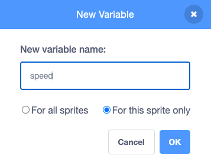

## ప్లాస్టిక్ వ్యర్థాలను జోడించండి

ఈ దశలో, మీరు మీ ఆటకు ప్లాస్టిక్ వ్యర్థాలను జోడిస్తారు.

Stage దిగువన ఉన్న sprite జాబితాలో, ప్లాస్టిక్ బాటిల్‌లా కనిపించే sprite పై క్లిక్ చేయండి. ఈ sprite లో నాలుగు costumes ఉన్నాయి: ఒక సీసా, ఒక రేపర్, ఒక బ్యాగ్ మరియు ఒక ప్లాస్టిక్ క్యాన్ హోల్డర్.

--- task ---

ఆకుపచ్చ జెండాను క్లిక్ చేసినప్పుడు, **Plastic** sprite, Stage పైభాగానికి వెళ్లి, ఆపై `hide`{:class="block3looks"} అవ్వాలి. కింది కోడ్‌ను **Plastic** sprite కు జోడించండి:


```blocks3
when flag clicked
go to x: (0) y: (200)
hide
```

--- /task ---

--- task ---

**Plastic** sprite ఇప్పుడు రాండమ్ గా దానికదే క్లోన్‌లను ఉత్పత్తి చేయాలి. కింది కోడ్‌ను జోడించండి:


```blocks3
when flag clicked
go to x: (0) y: (200)
hide
+forever
create clone of (myself v)
wait (pick random (1) to (5)) seconds
```

--- /task ---

--- task ---

క్లోన్‌ని సృష్టించినప్పుడు, అది `show`{:class="block3looks"} అవ్వాలి మరియు, `random`{:class="block3operators"} `costume`{:class="block3looks"} ఎంచుకోవాలి, ఆపై `random`{:class="block3operators"} `x`{:class="block3motion"} స్థానానికి కదలాలి. కింది కోడ్‌ని కొత్త స్క్రిప్ట్‌గా జోడించండి:


```blocks3
when I start as a clone
show
switch costume to (pick random (1) to (4)
go to x: (pick random (-200) to (200)) y: (200)
```

--- /task ---

--- task ---

మీరు ప్లాస్టిక్‌ను `random`{:class="block3operators"} వేగంతో Stage దిగువకు తరలించాలనుకుంటున్నారు, కాబట్టి కొత్త `variable`{:class="block3variables"} ని సృష్టించండి మరియు దానిని  `Speed` అని పిలవండి. `For this sprite only` కి దానిని సెట్ చేయండి:




--- /task ---

--- task ---

`Speed`{:class="block3variables"}ని ఒక `random`{:class="block3operators"} సంఖ్యగా సెట్ చేయండి. `repeat until`{:class="block3control"} బ్లాక్ ని ఉపయోగించండి, ఇది y అక్షం ( Stage దిగువన) పై `-180` వరకు క్లోన్ చేరుకోగానే కనుగొంటుంది. `Speed`{:class="block3variables"} వేరియబుల్‌ని ఉపయోగించి క్లోన్‌ను Stage క్రిందికి తరలించండి. చివరకు, `0.1` సెకండ్లకు `wait`{:class="block3control"} బ్లాక్‌ని జోడించండి, తద్వారా మీరు కదలికను చూడవచ్చు:


```blocks3
when I start as a clone
show
switch costume to (pick random (1) to (4)
go to x: (pick random (-200) to (200)) y: (200)
+set (speed v) to (pick random (-1) to (-10))
+repeat until <(y position) < (-180)>
change y by (speed)
wait (0.1) seconds

```

--- /task ---

మీ గేమ్‌ను అమలు చేయండి మరియు ప్లాస్టిక్ వ్యర్థాలు యాదృచ్ఛిక స్థానాల నుండి మరియు Stage పై నుండి యాదృచ్ఛిక వేగంతో పడిపోవడాన్ని మీరు చూడాలి. సమస్య ఏమిటంటే Stage దిగువన చెత్త పేరుకుపోయి అక్కడే ఉండిపోతుంది.

--- task ---

`delete this clone`{:class="block3control"} బ్లాక్‌ని జోడించండి, తద్వారా **Plastic** sprite, Stage దిగువన తాకినప్పుడు దానికదే తొలగించబడుతుంది:


```blocks3
when I start as a clone
show
switch costume to (pick random (1) to (4)
go to x: (pick random (-200) to (200)) y: (200)
set (speed v) to (pick random (-1) to (-10))
repeat until <(y position) < (-180)>
change y by (speed)
wait (0.1) seconds
end
+delete this clone
```

--- /task ---

--- save ---

