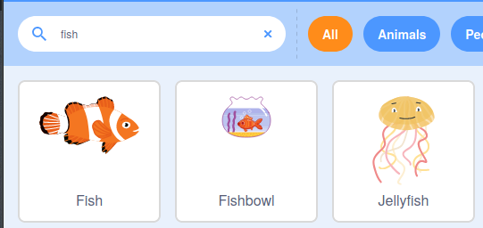

## సొరచేపకు ఆహారం ఇవ్వండి

ప్రస్తుతానికి, మీరు గేమ్ ఆడుతున్నప్పుడు, షార్క్ ప్లాస్టిక్‌ను నివారించాలి లేదా గేమ్ ముగుస్తుంది. ఈ దశలో, మీరు షార్క్ తన ఆరోగ్యాన్ని పెంచుకోవడానికి తినగలిగే చేపలను జోడించవచ్చు.

--- task ---

మీ ప్రాజెక్ట్‌కి **Fish** sprite ని జోడించండి.



--- /task ---

**Fish** sprite కోడ్ దాదాపు **Plastic** sprite కోడ్‌తో సమానంగా ఉంటుంది.

--- task ---

Sprite జాబితాలోని **Plastic** sprite నుండి **Fish** sprite కు మూడు స్క్రిప్ట్లను డ్రాగ్ చేసి డ్రాప్ చేయండి.


--- /task ---

--- task ---

ఇప్పుడు, మీరు సొరచేప ఆరోగ్యాన్ని తగ్గించే కోడ్‌ని సవరించవచ్చు, తద్వారా అది దాని ఆరోగ్యాన్ని `1` పెంచుతుంది:


```blocks3
when I start as a clone
forever
if <touching (Shark v)> then
+ change (health v) by (1)
delete this clone
```

--- /task ---

--- task ---

**Fish** sprite సైజ్ ప్రాపర్టీని `40` శాతానికి మరియు డైరెక్షన్ ప్రాపర్టీని `180` డిగ్రీలకు సెట్ చేయండి.


--- /task ---

--- task ---

చేపలను తింటే షార్క్ ఆరోగ్యం పెరుగుతుందో లేదో పరీక్షించడానికి ప్రోగ్రామ్‌ను మళ్లీ అమలు చేయండి.

--- /task ---


--- save ---


